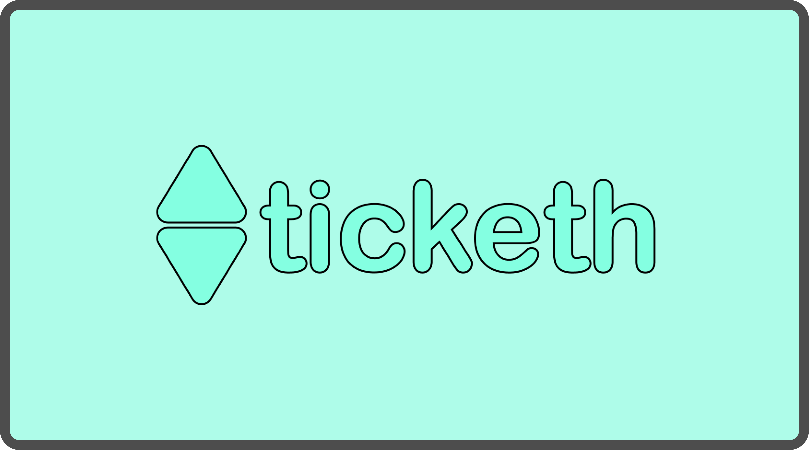
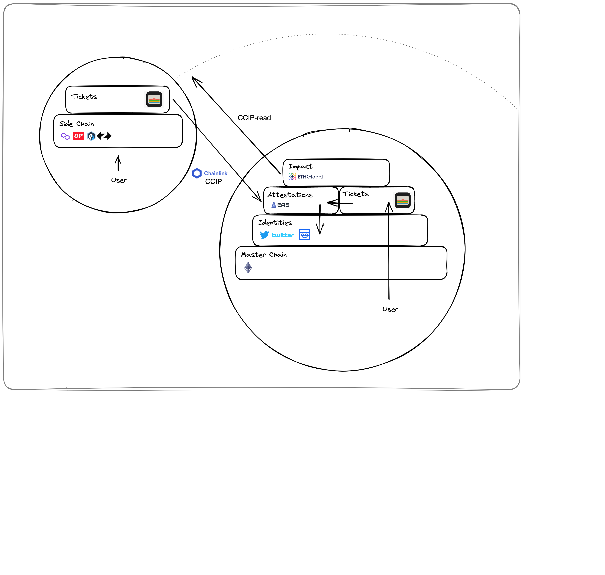

# ticketh

Ticketh is an attestation-based, cross-chain ticket reputation platform that rewards users for their active contributions. Meanwhile, event organizers can offer perks based on users' reputations or assets.

ETHGlobal Paris project by ITU Blockchain

### team
- [0xulas.eth](https://twitter.com/ulerdogan)
- [zetsub0ii.eth](https://twitter.com/zetsuboii_)

### technical flow

